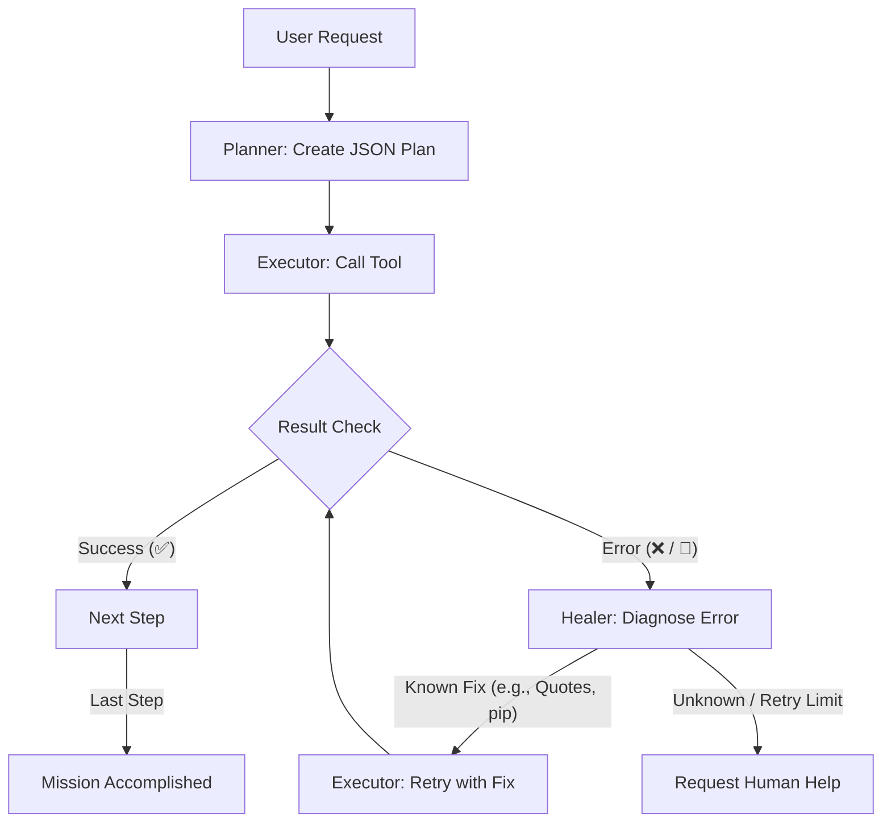

# 🌐 Atlas v4.0 "Foundation" — Technical Snapshot 2026

## 📝 Overview
**Atlas** is a high-autonomy agentic system designed for **Autonomous Engineering**. Unlike standard chat-bots, Atlas (implemented via the **AXIS** orchestrator) is built to pursue complex goals, self-heal from technical errors, and operate within a secured, path-aware environment.

---

## 🏗️ System Architecture

### 1. The Orchestrator (AXIS Core)
The primary entry point (`Atlas_v2/core/orchestrator.py`) handles:
- **Zero-Config Discovery**: Scans the system for IDEs, tools, and hardware.
- **Scoped Trust**: Dynamically sets folder permissions based on the active workspace.
- **Brain Sharding**: Split logic between a **Planner** (Gemini 2.0 Flash) and an **Executor** (Local Ollama).

### 2. Dual-Brain Reasoning
| Component | Engine | Role |
| :--- | :--- | :--- |
| **Planner** | Gemini 2.0 (Cloud) | Strategic decomposition of user requests into multi-step JSON plans. |
| **Executor** | Qwen2.5-Coder (Local) | Atomic tool execution, context management, and immediate result parsing. |

### 3. Safety & Security (Bunker v5.5)
- **Security Guard**: Regex-based filtering of dangerous commands (rm -rf, direct disk writes).
- **Firewall**: Intercepts payloads before they reach the shell.
- **Protocol 2.0 Integrity**: Errors like `🚨 [SECURITY REJECTED]` or `❌ [FAILED]` trigger an immediate autonomous repair loop instead of reporting success.

---

## 🛡️ Protocol 2.0: Self-Healing Logic

Protocol 2.0 is the "immune system" of AXIS, ensuring the agent doesn't "hallucinate" success when a command fails.

### Key Repair Recipes:
- **Git Quoting**: Forces double quotes (`" "`) on Windows to prevent `pathspec` errors.
- **Module Discovery**: Automatially triggers `pip install` or logic refactoring upon `ModuleNotFoundError`.
- **Security Bypassing**: Suggests writing code to a `.py` file if a complex one-liner is blocked by the shell firewall.

---

## 🗺️ Roadmap 2026

### 🟢 Phase 1: Context Mastery (Q1 2026) - **ACTIVE**
- [x] **Antigravity IDE Integration**: Automatic detection and prioritization of the current editor.
- [x] **Path-Aware Workspaces**: Robust handling of absolute paths in `LegalMind` and other sub-projects.
- [x] **Self-Healing Core**: Infinite loop prevention with a 2-retry limit.

### 🟡 Phase 2: Cognitive Hardening (Q2 2026)
- [ ] **Agentic Graph Memory**: Replacing linear history with a graph of "locations" (paths) and "facts" (results).
- [ ] **Deep Traceback Analysis**: Reading `error.log` automatically to extract specific line numbers for refactoring.
- [ ] **RAG 3.0**: Semi-persistent caching of project schemas to speed up repetitive tasks.

### 🔴 Phase 3: Ecological Isolation (Q3 2026)
- [ ] **Auto-Venv Sandboxing**: Automatic creation/activation of virtual environments for every new project.
- [ ] **Autonomous Testing (Pytest Auto-Run)**: AXIS will refuse to commit code unless it writes and passes its own tests.

---

## 🛠️ Technical Documentation

### Core Modules:
- `core/orchestrator.py`: The heart of Atlas.
- `core/brain/healer.py`: Contains the "recipes" for self-correction.
- `core/system/discovery.py`: How Atlas "sees" your computer.
- `agent_skills/terminal_operator/`: Executes terminal commands with auto-fix directives.
- `agent_skills/workspace_manager/`: Handles project-switching and IDE launching.

---
> **Status**: v4.0.0-beta-2 (Clean Slate)
> **Stability**: 88% Autonomy on Windows CMD.
