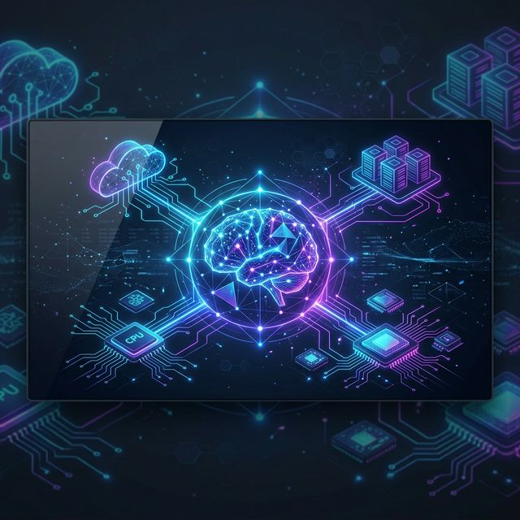
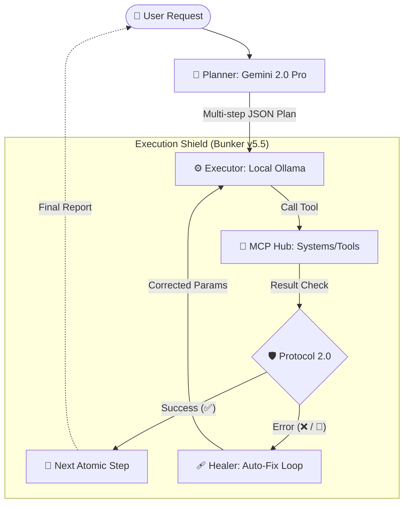

<div align="center">



# 🌐 AXIS v2.7 — Autonomous Operations Framework

[](https://www.python.org/downloads/)
[](https://github.com/Eugen1189/ATLAS-AI)
[]()
[](AGENTS.md)

**AXIS** (Autonomous Spatial Intelligence & MCP Framework) is a high-autonomy agentic system designed for **Autonomous Engineering**. Unlike traditional LLM wrappers, AXIS is built to pursue complex goals, self-heal from technical errors, and operate within a secured, path-aware environment.

[Features](#-key-features) • [Architecture](#-system-architecture) • [Getting Started](#-quick-start) • [Roadmap](#-roadmap-2026)

</div>

---

## 🏗️ System Architecture

AXIS operates on a **Dual-Brain Topology**, separating high-level strategy (Planner) from low-level technical execution (Executor). This ensures maximum reliability and safety through structured JSON reasoning.



### 🧠 Dual-Brain Reasoning
| Layer | Engine | Primary Function |
| :--- | :--- | :--- |
| **Mission Planner** | Gemini 2.0 Flash | Strategic decomposition of abstract goals into actionable multi-step JSON sequences. |
| **Atomic Executor** | Qwen2.5-Coder (Local) | Precision tool interaction, context management, and immediate state validation. |

---

## 🛡️ Protocol 2.0: The Immune System

One of the most powerful features of AXIS is its **Self-Healing Core**. Instead of reporting failure when a task hits an environmental roadblock (missing libraries, OS permission errors, syntax mistakes), AXIS enters an autonomous repair loop.

- **Dynamic Discovery**: Auto-detects IDEs, workspaces, and system tools.
- **Auto-Fix Directives**: Monitors `stderr` for `[CRITICAL SYSTEM DIRECTIVE]` flags to trigger immediate intervention.
- **Scoped Trust**: Dynamically configures directory permissions to isolate risky operations.

---

## ✨ Key Features

- **🚀 Mission-Driven Autonomy**: Handles complex, open-ended tasks without constant human intervention.
- **📨 MCP Integration**: Built-in support for **Model Context Protocol**, allowing hot-swapping of capabilities and cross-server communication.
- **👁️ Spatial & Visual Awareness**: Real-time telemetry, HUD visualization (PyQt6), and computer vision (Mediapipe/OpenCV) for GUI interaction.
- **🔌 Isolated Agent Skills**: Extend system capabilities via a modular "Skill Directory" pattern.
- **🛠️ Self-Provisioning**: Automatically manages its own environment (virtualenvs, dependencies) when needed.

---

## 🛠️ Technological Stack

- **Core Engine**: Python 3.11+ (Strict typing, Structlog)
- **RAG & Memory**: ChromaDB (Vector Search)
- **Communication**: MCP Server Protocol (Filesystem, GitHub, Terminal)
- **Local Processing**: Ollama (Qwen2.5-Coder / Llama3)
- **Interface**: PyQt6 (Head-Up Display) & Telegram (Remote Operations)

---

## 🚀 Quick Start

### Prerequisites
- [Python 3.11+](https://www.python.org/downloads/)
- [Ollama](https://ollama.ai/) (Running locally for Executor logic)
- [Gemini API Key](https://aistudio.google.com/app/apikey) (For Planning logic)

### Installation
1.  **Clone the Repository**
    ```bash
    git clone https://github.com/Eugen1189/ATLAS-AI.git
    cd ATLAS-AI
    ```

2.  **Environment Setup**
    ```bash
    # Create and activate venv
    python -m venv venv
    .\venv\Scripts\activate  # On Windows

    # Install dependencies
    pip install -e .
    ```

3.  **Configuration**
    Copy `.env.example` to `.env` and configure your API keys.

4.  **Launch AXIS**
    ```bash
    python Atlas_v2/main.py
    ```

---

## 🗺️ Roadmap 2026

- [x] **v2.5: Context Mastery** - Robust path-awareness and cross-project navigation.
- [x] **v2.7: Autonomous Engineering** - Protocol 2.0 self-healing integration.
- [ ] **v3.0: Cognitive Hardening** - Implementation of Agentic Graph Memory for long-term facts.
- [ ] **v3.5: Sandboxed Eco-Systems** - Full containerization of executor environments for zero-risk production edits.

---

## 📜 Project Constitution

All development on AXIS follows the **AXIS Project Constitution**. Refer to the following documents for deep-dives into operational logic:

- 🤖 [AGENTS.md](AGENTS.md) — Core technical standards and security protocols.
- 🛠️ [CLAUDE.md](CLAUDE.md) — Practical integration guidelines and build instructions.
- 🔭 [PROJECT_SNAPSHOT.md](PROJECT_SNAPSHOT.md) — Detailed technical architecture and roadmap.

---

<div align="center">
    <i>Created as part of the 2026 AI Autonomous Standard Integration.</i><br>
    <b>Empowering the future of Autonomous Engineering.</b>
</div>
